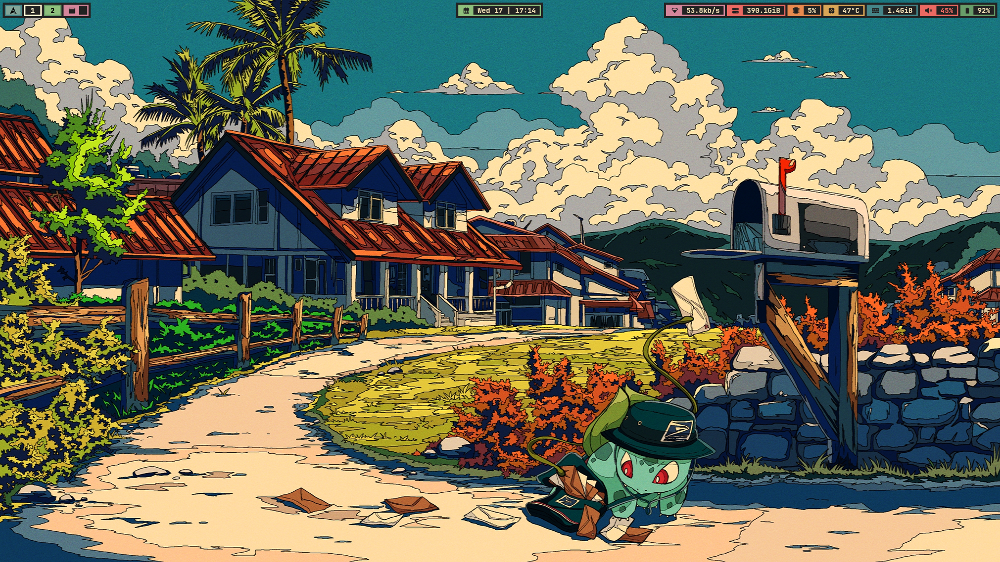

# Dots

"minimal" sway config catered for my workflow.

### Credits
- most of this config is stolen from [Bibjaw](https://github.com/bibjaw99) with minor changes 
- [orignal repo](https://github.com/bibjaw99/workstation)
